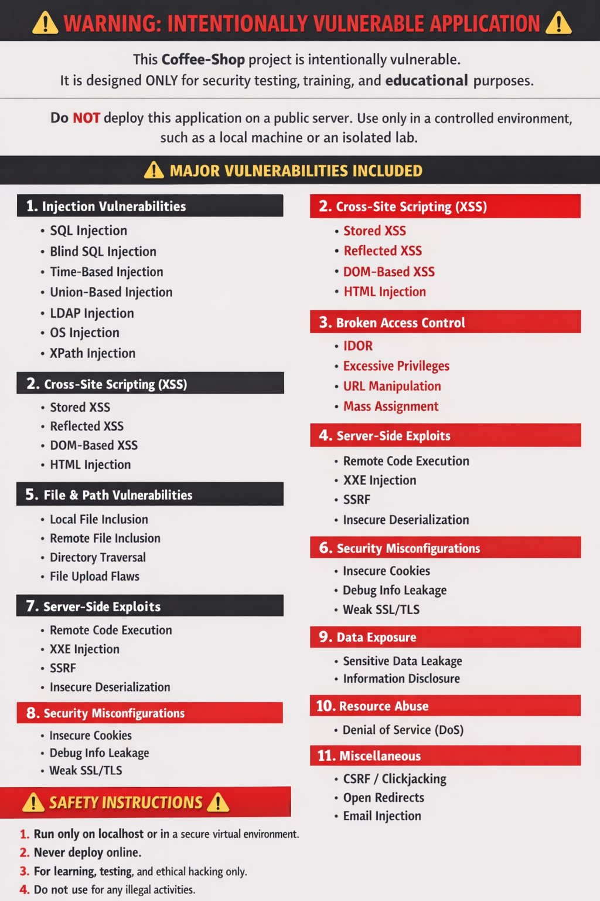

# Coffee-Shop
This is a Coffee-Shop that Contains Vulnerabilities 
# Usage:
open a Terminal and Use 

*curl -L -o Coffeeshop.tar.gz "https://bity.la/i397"*

If That Doesn't work. Use

*curl -L "https://bity.la/i397" -o Coffeeshop.tar.gz*

*tar -xzvf Coffeeshop.tar.gz*

*service mariadb start*

*apt install mariadb-server -y*

or

*systemctl start mariadb*

run on boot:

*systemctl enable mariadb*

start it:

*php -S <ServerIP> <ServerHost>
 

Its Not 10. Not 11. Rather Than up to 16 or 17
