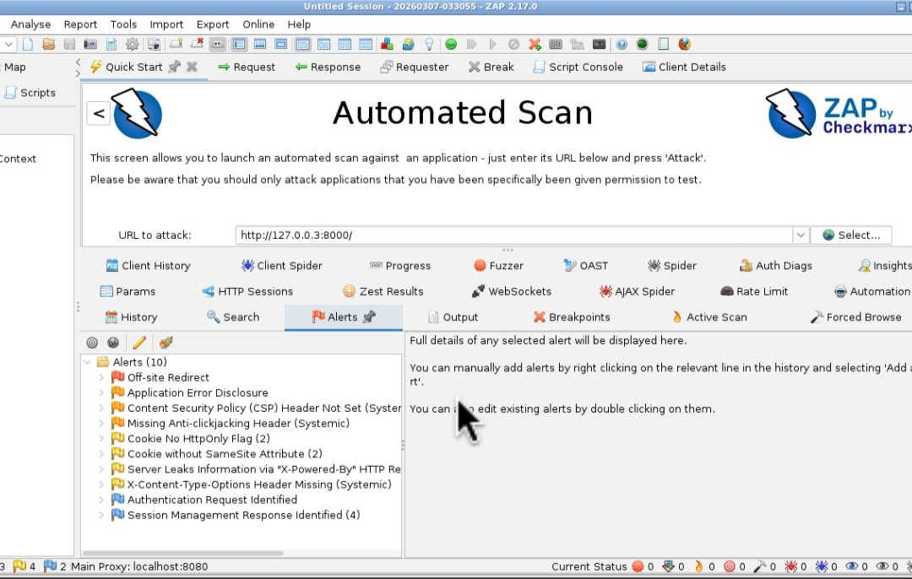

# Coffee-Shop
This is a Coffee-Shop that Contains Vulnerabilities 
# Usage:
open a Terminal and Use 

*curl -L -o Coffeeshop.tar.gz "https://bity.la/i397"*

If That Doesn't work. Use

*curl -L "https://bity.la/i397" -o Coffeeshop.tar.gz*

 
